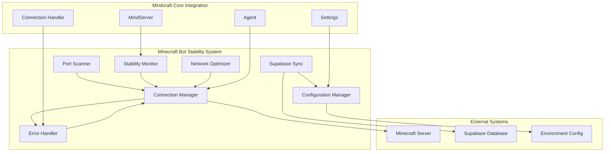
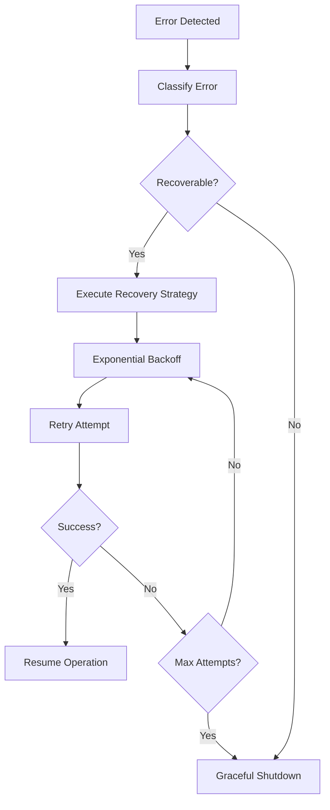

# Design Document: Minecraft Bot Stability

## Overview

Hệ thống Minecraft Bot Stability được thiết kế để cải thiện tính ổn định kết nối, xử lý lỗi thông minh, và tích hợp Supabase đáng tin cậy cho mindcraft-core framework. Thiết kế này tập trung vào việc xây dựng các component mới và mở rộng các module hiện có để đảm bảo bot có thể duy trì kết nối ổn định, tự động phục hồi từ lỗi, và đồng bộ dữ liệu một cách đáng tin cậy.

Hệ thống sẽ được tích hợp vào mindcraft-core framework hiện tại mà không làm thay đổi cấu trúc cốt lõi, đồng thời cung cấp các tính năng mới như automatic port detection, intelligent error recovery, và real-time monitoring.

## Architecture

### High-Level Architecture



### Component Integration Points

1. **Agent Integration**: Connection Manager sẽ được tích hợp vào Agent class thông qua dependency injection
2. **MindServer Integration**: Stability Monitor sẽ expose metrics qua MindServer UI
3. **Settings Integration**: Configuration Manager sẽ extend settings.js hiện tại
4. **Connection Handler Enhancement**: Error Handler sẽ mở rộng connection_handler.js

## Components and Interfaces

### 1. Connection Manager

**Responsibility**: Quản lý kết nối đến Minecraft server với logic reconnection thông minh

```javascript
class ConnectionManager {
    constructor(agent, config) {
        this.agent = agent;
        this.config = config;
        this.reconnectionHandler = new ReconnectionHandler(this);
        this.networkOptimizer = new NetworkOptimizer(this);
        this.stabilityMonitor = new StabilityMonitor(this);
    }
    
    async connect(host, port, options = {}) {}
    async disconnect(graceful = true) {}
    async reconnect(reason) {}
    
    // Keep-alive management
    startKeepAlive() {}
    stopKeepAlive() {}
    
    // Connection quality monitoring
    getConnectionQuality() {}
    isConnectionStable() {}
}
```

**Integration**: Sẽ được inject vào Agent class và thay thế logic kết nối hiện tại trong `initBot()`

### 2. Port Scanner

**Responsibility**: Tự động phát hiện port LAN của Minecraft server

```javascript
class PortScanner {
    constructor(config) {
        this.config = config;
        this.lastKnownPort = null;
        this.scanRange = { min: 25565, max: 65535 };
    }
    
    async scanForMinecraftServer(host = 'localhost') {}
    async quickScan(priorityPorts = []) {}
    async fullScan() {}
    
    // Port validation
    async validatePort(host, port) {}
    isMinecraftServer(host, port) {}
}
```

**Integration**: Sẽ được gọi từ Connection Manager khi port hiện tại không khả dụng

### 3. Error Handler

**Responsibility**: Phân loại và xử lý các loại lỗi kết nối khác nhau

```javascript
class ErrorHandler {
    constructor(connectionManager) {
        this.connectionManager = connectionManager;
        this.errorClassifier = new ErrorClassifier();
        this.recoveryStrategies = new Map();
    }
    
    async handleError(error, context) {}
    classifyError(error) {}
    
    // Recovery strategies
    async executeRecoveryStrategy(errorType, context) {}
    registerRecoveryStrategy(errorType, strategy) {}
    
    // Error reporting
    reportError(error, context, action) {}
    getErrorHistory() {}
}
```

**Integration**: Sẽ mở rộng `connection_handler.js` hiện tại và được sử dụng trong Agent error events

### 4. Supabase Sync Service

**Responsibility**: Đồng bộ dữ liệu với Supabase một cách đáng tin cậy

```javascript
class SupabaseSync {
    constructor(config) {
        this.config = config;
        this.client = null;
        this.offlineQueue = [];
        this.syncInterval = 30000; // 30 seconds
    }
    
    async initialize() {}
    async sync() {}
    
    // Offline handling
    async queueForSync(data) {}
    async processOfflineQueue() {}
    
    // Data operations
    async saveAgentState(agentId, state) {}
    async loadAgentState(agentId) {}
    async syncMemoryBank(memoryData) {}
}
```

**Integration**: Sẽ được tích hợp vào Agent class và MemoryBank để đồng bộ dữ liệu

### 5. Configuration Manager

**Responsibility**: Quản lý cấu hình hệ thống một cách linh hoạt

```javascript
class ConfigurationManager {
    constructor() {
        this.config = new Map();
        this.validators = new Map();
        this.backups = [];
    }
    
    async loadConfiguration() {}
    async saveConfiguration() {}
    
    // Configuration validation
    validateConfig(key, value) {}
    registerValidator(key, validator) {}
    
    // Backup and restore
    createBackup() {}
    restoreFromBackup(backupId) {}
    
    // Environment integration
    loadFromEnvironment() {}
    overrideFromEnv(envVars) {}
}
```

**Integration**: Sẽ extend `settings.js` hiện tại và được sử dụng trong `main.js`

### 6. Stability Monitor

**Responsibility**: Theo dõi và báo cáo tình trạng kết nối

```javascript
class StabilityMonitor {
    constructor(connectionManager) {
        this.connectionManager = connectionManager;
        this.metrics = new MetricsCollector();
        this.dashboard = new DashboardProvider();
    }
    
    // Metrics collection
    collectMetrics() {}
    calculateUptime() {}
    measureLatency() {}
    detectPacketLoss() {}
    
    // Alerting
    checkThresholds() {}
    sendAlert(type, message) {}
    
    // Dashboard integration
    getRealtimeStatus() {}
    getHistoricalData() {}
}
```

**Integration**: Sẽ được tích hợp vào MindServer để hiển thị dashboard

### 7. Network Optimizer

**Responsibility**: Tối ưu hóa việc sử dụng mạng

```javascript
class NetworkOptimizer {
    constructor(connectionManager) {
        this.connectionManager = connectionManager;
        this.adaptiveSettings = new AdaptiveSettings();
    }
    
    // Network adaptation
    adaptToNetworkConditions() {}
    adjustPacketRate(conditions) {}
    enableCompression() {}
    
    // Packet prioritization
    prioritizePackets(packets) {}
    handleHighLatency() {}
    
    // Timeout management
    calculateOptimalTimeouts() {}
    setDynamicTimeouts() {}
}
```

**Integration**: Sẽ được sử dụng bởi Connection Manager để tối ưu hóa kết nối

## Data Models

### Connection State Model

```javascript
class ConnectionState {
    constructor() {
        this.status = 'disconnected'; // disconnected, connecting, connected, reconnecting
        this.host = null;
        this.port = null;
        this.lastConnected = null;
        this.connectionAttempts = 0;
        this.quality = {
            latency: 0,
            packetLoss: 0,
            uptime: 0
        };
    }
}
```

### Error Context Model

```javascript
class ErrorContext {
    constructor(error, timestamp = Date.now()) {
        this.error = error;
        this.timestamp = timestamp;
        this.type = null; // will be classified
        this.recoverable = null;
        this.attempts = 0;
        this.lastAttempt = null;
        this.resolved = false;
    }
}
```

### Configuration Schema

```javascript
const ConfigSchema = {
    connection: {
        maxReconnectAttempts: { type: 'number', default: 5, min: 1, max: 10 },
        reconnectDelay: { type: 'number', default: 1000, min: 500, max: 30000 },
        keepAliveInterval: { type: 'number', default: 30000, min: 10000, max: 60000 },
        connectionTimeout: { type: 'number', default: 10000, min: 5000, max: 30000 }
    },
    portScanning: {
        enabled: { type: 'boolean', default: true },
        scanTimeout: { type: 'number', default: 30000, min: 10000, max: 60000 },
        priorityPorts: { type: 'array', default: [25565, 25566, 25567] }
    },
    supabase: {
        syncInterval: { type: 'number', default: 30000, min: 10000, max: 300000 },
        offlineMode: { type: 'boolean', default: true },
        maxQueueSize: { type: 'number', default: 1000, min: 100, max: 5000 }
    },
    monitoring: {
        enabled: { type: 'boolean', default: true },
        metricsInterval: { type: 'number', default: 5000, min: 1000, max: 30000 },
        alertThresholds: {
            latency: { type: 'number', default: 1000, min: 100, max: 5000 },
            packetLoss: { type: 'number', default: 0.05, min: 0.01, max: 0.5 }
        }
    }
};
```

### Metrics Data Model

```javascript
class ConnectionMetrics {
    constructor() {
        this.uptime = 0;
        this.totalConnections = 0;
        this.successfulConnections = 0;
        this.failedConnections = 0;
        this.averageLatency = 0;
        this.packetLoss = 0;
        this.lastUpdate = Date.now();
        this.history = []; // Array of historical data points
    }
}
```

## Correctness Properties

*A property is a characteristic or behavior that should hold true across all valid executions of a system-essentially, a formal statement about what the system should do. Properties serve as the bridge between human-readable specifications and machine-verifiable correctness guarantees.*

After analyzing the acceptance criteria, I identified several properties that can be consolidated to eliminate redundancy:

**Property Reflection:**
- Properties 1.1 and 1.5 (connection stability and keep-alive) can be combined into a comprehensive connection maintenance property
- Properties 4.1 and 4.3 (ECONNREFUSED handling and recoverable error retries) can be combined into a single exponential backoff property
- Properties 5.4 and 4.1 (Supabase API retry and connection retry) both use exponential backoff and can reference a common backoff property
- Properties 7.1 and 7.4 (metrics collection and history storage) can be combined into a comprehensive monitoring property
- Properties 9.4 and 9.5 (timeout handling and packet prioritization) can be combined into a network operation management property

### Property 1: Connection Stability Maintenance

*For any* established connection to a Minecraft server, the Connection Manager should maintain the connection for at least 5 minutes under normal conditions while sending keep-alive packets at regular intervals.

**Validates: Requirements 1.1, 1.5**

### Property 2: Automatic Reconnection Timing

*For any* network-related disconnection, the Reconnection Handler should attempt to reconnect within 10 seconds of detecting the disconnection.

**Validates: Requirements 1.2**

### Property 3: Connection Quality Monitoring

*For any* active connection, the Stability Monitor should continuously track connection quality metrics (latency, packet loss, uptime) and log all disconnection events with timestamps and reasons.

**Validates: Requirements 1.3, 7.1, 7.4**

### Property 4: High Latency Alerting

*For any* connection where ping time exceeds 1000ms, the Connection Manager should generate a high latency alert.

**Validates: Requirements 1.4**

### Property 5: Port Detection Timing

*For any* new Minecraft server that opens a LAN port, the Port Scanner should detect the port within 30 seconds of it becoming available.

**Validates: Requirements 2.1**

### Property 6: Port Scanning Range Coverage

*For any* port scanning operation, the Port Scanner should check all ports in the range 25565 to 65535 when searching for Minecraft servers.

**Validates: Requirements 2.2**

### Property 7: Automatic Configuration Updates

*For any* newly detected port, the Configuration Manager should automatically update the system configuration to use the new port.

**Validates: Requirements 2.3**

### Property 8: Port Prioritization

*For any* port scanning operation, the Port Scanner should check previously used ports before scanning the full range.

**Validates: Requirements 2.4**

### Property 9: Version Compatibility Handling

*For any* version mismatch detected during connection, the Connection Manager should attempt to use a compatible protocol version before failing.

**Validates: Requirements 3.2**

### Property 10: Pre-Connection Version Validation

*For any* connection attempt, the Bot System should verify version compatibility before initiating the connection.

**Validates: Requirements 3.5**

### Property 11: Exponential Backoff for Recoverable Errors

*For any* recoverable error (including ECONNREFUSED and Supabase API errors), the system should retry with exponential backoff, attempting up to 5 times with increasing delays.

**Validates: Requirements 4.1, 4.3, 5.4**

### Property 12: Error Classification

*For any* error encountered during operation, the Error Handler should correctly classify it as either recoverable or non-recoverable.

**Validates: Requirements 4.2**

### Property 13: Comprehensive Error Logging

*For any* error that occurs, the Error Handler should log detailed information including the error cause, context, and actions taken.

**Validates: Requirements 4.4**

### Property 14: Non-Recoverable Error Handling

*For any* non-recoverable error, the Bot System should stop gracefully and provide clear notification to the user.

**Validates: Requirements 4.5**

### Property 15: Environment-Based Supabase Connection

*For any* Supabase connection attempt, the Supabase Sync service should use connection information from environment variables.

**Validates: Requirements 5.1**

### Property 16: Offline Mode Fallback

*For any* Supabase connection failure, the Supabase Sync service should automatically switch to offline mode and continue operating.

**Validates: Requirements 5.2**

### Property 17: Regular Data Synchronization

*For any* active Supabase connection, the Supabase Sync service should synchronize bot data every 30 seconds.

**Validates: Requirements 5.3**

### Property 18: Local Data Caching

*For any* period without internet connectivity, the Supabase Sync service should cache data locally and sync when connectivity is restored.

**Validates: Requirements 5.5**

### Property 19: Multi-Source Configuration Loading

*For any* system startup, the Configuration Manager should successfully load configuration from both .env files and settings.js.

**Validates: Requirements 6.1**

### Property 20: Environment Variable Override

*For any* configuration parameter that exists in both files and environment variables, the environment variable value should take precedence.

**Validates: Requirements 6.2**

### Property 21: Configuration Validation

*For any* configuration change, the Configuration Manager should validate the new values before applying them.

**Validates: Requirements 6.3**

### Property 22: Configuration Backup

*For any* configuration change, the Configuration Manager should create a backup of the current configuration before applying the new values.

**Validates: Requirements 6.4**

### Property 23: Default Value Provision

*For any* critical system parameter, the Configuration Manager should provide a sensible default value when no explicit configuration is provided.

**Validates: Requirements 6.5**

### Property 24: Threshold-Based Alerting

*For any* connection quality metric that falls below its configured threshold, the Stability Monitor should generate and send an appropriate alert.

**Validates: Requirements 7.3**

### Property 25: Authentication Mode Support

*For any* authentication request, the Bot System should successfully handle both offline and Microsoft authentication modes.

**Validates: Requirements 8.1**

### Property 26: Token Management for Microsoft Auth

*For any* Microsoft authentication session, the Bot System should cache the authentication token and refresh it when necessary.

**Validates: Requirements 8.2**

### Property 27: Username Validation

*For any* connection attempt, the Bot System should validate the username format before attempting to connect.

**Validates: Requirements 8.3**

### Property 28: Authentication Data Protection

*For any* authentication information in the system, it should be protected from exposure in logs and memory dumps.

**Validates: Requirements 8.5**

### Property 29: Adaptive Network Optimization

*For any* change in network conditions, the Connection Manager should adjust packet send rates, enable compression when possible, and reduce non-critical operations during high latency.

**Validates: Requirements 9.1, 9.2, 9.3**

### Property 30: Network Operation Management

*For any* network operation, the Connection Manager should implement appropriate timeouts and prioritize critical packets (movement, chat) over non-critical ones.

**Validates: Requirements 9.4, 9.5**

### Property 31: Graceful Shutdown Timing

*For any* shutdown signal received, the Bot System should close all connections and complete shutdown within 5 seconds.

**Validates: Requirements 10.1**

### Property 32: State Persistence During Shutdown

*For any* shutdown event, the Bot System should save the current state before terminating.

**Validates: Requirements 10.2**

### Property 33: Resource Cleanup

*For any* shutdown event, the Bot System should properly cleanup all resources including sockets, timers, and file handles.

**Validates: Requirements 10.3**

### Property 34: Final Data Synchronization

*For any* shutdown event, the Supabase Sync service should complete any pending data synchronization before the system terminates.

**Validates: Requirements 10.4**

### Property 35: Shutdown Event Logging

*For any* shutdown event, the Bot System should log the event with a timestamp and the reason for shutdown.

**Validates: Requirements 10.5**

## Error Handling

### Error Classification Strategy

The system implements a comprehensive error classification approach:

1. **Network Errors**: ECONNREFUSED, ETIMEDOUT, ENOTFOUND
   - Classification: Recoverable
   - Strategy: Exponential backoff with port scanning fallback

2. **Authentication Errors**: Invalid credentials, token expiration
   - Classification: Depends on error type
   - Strategy: Token refresh for Microsoft auth, user notification for invalid credentials

3. **Version Compatibility Errors**: Protocol mismatch, unsupported features
   - Classification: Potentially recoverable
   - Strategy: Protocol adaptation, fallback to compatible version

4. **Supabase API Errors**: Rate limiting, temporary service unavailability
   - Classification: Recoverable
   - Strategy: Exponential backoff with offline mode fallback

5. **Configuration Errors**: Invalid settings, missing required parameters
   - Classification: Non-recoverable
   - Strategy: Validation with clear error messages and default fallbacks

### Recovery Mechanisms



### Error Context Preservation

All errors maintain context including:
- Original error details
- System state at time of error
- Previous recovery attempts
- Network conditions
- Configuration state

## Testing Strategy

### Dual Testing Approach

The system requires both unit testing and property-based testing for comprehensive coverage:

**Unit Tests** focus on:
- Specific error scenarios and edge cases
- Integration points between components
- Configuration validation with known invalid inputs
- Authentication flow with mock services
- Dashboard UI functionality

**Property-Based Tests** focus on:
- Universal properties across all inputs
- Connection stability under various network conditions
- Error recovery behavior with random error injection
- Configuration management with generated valid/invalid configs
- Data synchronization with simulated network interruptions

### Property-Based Testing Configuration

- **Testing Library**: fast-check for JavaScript/Node.js
- **Minimum Iterations**: 100 per property test
- **Test Tagging**: Each property test tagged with format:
  `Feature: minecraft-bot-stability, Property {number}: {property_text}`

### Test Categories

1. **Connection Management Tests**
   - Property tests for connection stability and reconnection
   - Unit tests for specific network error scenarios
   - Integration tests with real Minecraft servers

2. **Port Scanning Tests**
   - Property tests for port detection timing and range coverage
   - Unit tests for port validation logic
   - Integration tests with dynamic port allocation

3. **Configuration Management Tests**
   - Property tests for configuration loading and validation
   - Unit tests for environment variable override behavior
   - Integration tests with various configuration sources

4. **Supabase Integration Tests**
   - Property tests for sync timing and offline behavior
   - Unit tests for API error handling
   - Integration tests with Supabase test environment

5. **Monitoring and Alerting Tests**
   - Property tests for metrics collection and threshold alerting
   - Unit tests for dashboard data formatting
   - Integration tests with MindServer UI

### Test Environment Setup

```javascript
// Example property test configuration
const fc = require('fast-check');

describe('Connection Manager Properties', () => {
    it('Property 1: Connection Stability Maintenance', () => {
        // Feature: minecraft-bot-stability, Property 1: Connection stability maintenance
        fc.assert(fc.property(
            fc.record({
                host: fc.string(),
                port: fc.integer(1024, 65535),
                networkConditions: fc.record({
                    latency: fc.integer(0, 500),
                    packetLoss: fc.float(0, 0.01)
                })
            }),
            async (config) => {
                const connectionManager = new ConnectionManager(mockAgent, config);
                const startTime = Date.now();
                
                await connectionManager.connect(config.host, config.port);
                
                // Simulate 5+ minutes of operation
                await simulateTime(5 * 60 * 1000, config.networkConditions);
                
                const uptime = connectionManager.getUptime();
                expect(uptime).toBeGreaterThanOrEqual(5 * 60 * 1000);
                expect(connectionManager.isKeepAliveActive()).toBe(true);
            }
        ), { numRuns: 100 });
    });
});
```

### Continuous Integration

- All property tests run on every commit
- Integration tests run on pull requests
- Performance benchmarks run nightly
- Compatibility tests run against multiple Minecraft versions

The testing strategy ensures that both specific scenarios and general system behavior are thoroughly validated, providing confidence in the system's reliability and correctness.